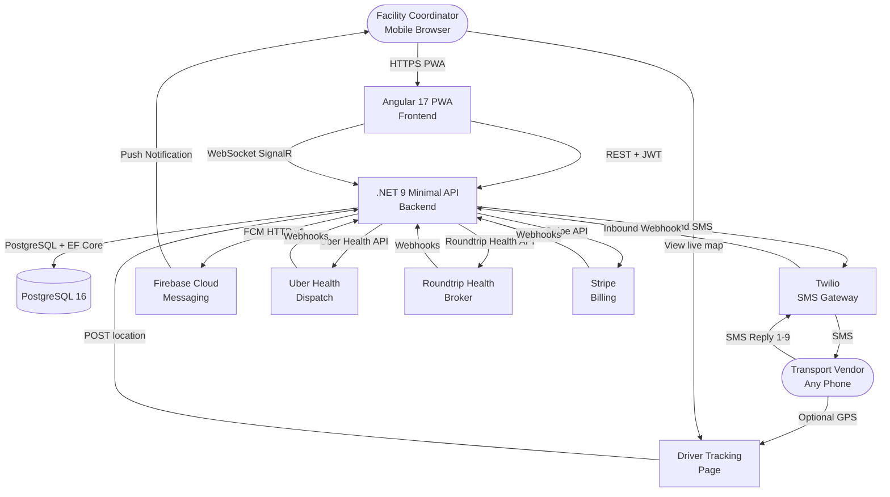
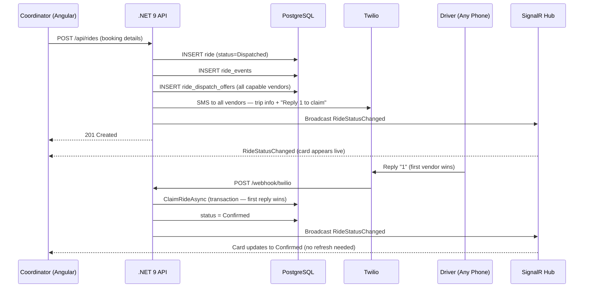
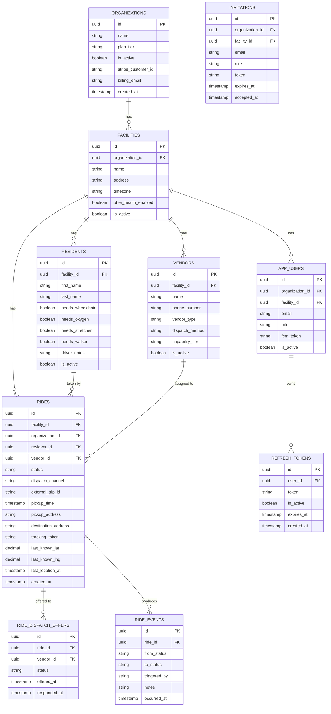

# Solution Architecture: KinCare

**Version:** 2.0  
**Date:** 2026-07-01  
**Author:** JVincent1  
**Status:** Active — Production Development

---

## Table of Contents

1. [Context and Scope](#1-context-and-scope)
2. [Architecture Overview](#2-architecture-overview)
3. [Component Architecture](#3-component-architecture)
4. [Data Architecture](#4-data-architecture)
5. [Integration Architecture](#5-integration-architecture)
6. [Security Architecture](#6-security-architecture)
7. [Deployment Architecture](#7-deployment-architecture)
8. [Quality Attributes](#8-quality-attributes)
9. [Architectural Decisions](#9-architectural-decisions)
10. [Technology Stack](#10-technology-stack)
11. [Risk Assessment](#11-risk-assessment)
12. [Feature Build Status](#12-feature-build-status)
13. [Outstanding Work (TODO)](#13-outstanding-work-todo)
14. [Future Considerations](#14-future-considerations)
15. [Appendix](#15-appendix)

---

## Executive Summary

KinCare is a multi-tenant B2B SaaS platform that replaces manual, phone-based resident transport coordination at senior living facilities with a mobile-first real-time coordination layer. The platform gives facility coordinators real-time visibility over every ride — from booking through safe dropoff — without requiring drivers to install any app.

The architecture is a three-tier system: an Angular 17 PWA frontend served to the coordinator's mobile browser, a **.NET 9** Minimal API handling all business logic and integrations, and a PostgreSQL 16 database enforcing multi-tenant data isolation. The platform is a multi-tenant B2B SaaS product with a full **Organization → Facility → User** hierarchy, plan tiers (Starter / Professional / Enterprise), Stripe billing, and self-service onboarding.

External integrations include Twilio (bidirectional SMS), Firebase Cloud Messaging (coordinator push notifications), Uber Health API (ambulatory dispatch on Professional plan), Roundtrip Health broker API (NEMT fallback), Stripe (subscription billing), and SignalR (real-time dashboard WebSocket).

**Key Points:**

- Multi-tenant: one deployment serves all clients; each org is fully isolated
- Coordinator-first, mobile-first — every action completable in three taps at 390px
- Vendors interact via SMS only — zero onboarding required on their side
- Adaptive dispatch: SMS for basic/NEMT vendors, Uber Health for ambulatory on Professional plan, broker fallback
- Strict 9-state machine (Dispatched → Confirmed → EnRoute → Arrived → PickedUp → AtDestination → Dropped → Completed / Cancelled) with time-based automated escalation
- Multi-tenant isolation enforced at PostgreSQL row level and EF Core global query filters
- Stripe subscription billing with 14-day free trial and webhook-driven plan enforcement

---

## 1. Context and Scope

### 1.1 Business Context

Facility coordinators at small-to-medium assisted living facilities (10–80 beds) manage resident transport entirely by phone and memory today. The critical gap is wheelchair and NEMT transport — coordinators book verbally, have zero visibility after booking, and only learn of failures (no-shows, late pickups) after the fact. Residents — many with mobility equipment — are left waiting or stranded.

KinCare replaces that entire workflow with a structured, real-time coordination platform that keeps the coordinator informed at every stage of every ride without depending on driver initiative to communicate.

**Business Goals:**

- Eliminate coordinator blind spots between ride booking and resident safe dropoff
- Reduce no-show cancellation fees through proactive driver communication and escalation
- Create a permanent, exportable record of every resident transport for facility compliance
- Support multiple paying B2B clients (organizations) from a single deployment
- Generate recurring SaaS revenue via Stripe subscription tiers

**Success Metrics:**

- Ride booking time: < 3 minutes (vs. 10–15 min phone calls today)
- Status update latency: < 5 seconds from driver SMS reply to coordinator dashboard update (SignalR)
- Arrival alert delivery: < 3 seconds from trigger to FCM push notification
- Zero missed escalation alerts: 100% of silent-driver thresholds trigger coordinator notification
- Coordinator adoption: daily active use within first week of deployment

### 1.2 System Scope

**In Scope (all implemented):**

- Multi-tenant organization/facility hierarchy with self-service onboarding
- Coordinator authentication, JWT-based sessions, refresh token rotation
- Role-based access: SuperAdmin / OrgAdmin / Coordinator
- Plan tiers: Starter / Professional / Enterprise with feature gating
- Stripe subscription billing with webhook-driven plan enforcement
- Resident profile management (special needs flags, driver notes)
- Vendor management (type, dispatch method, capability tier)
- Ride booking with DispatchRouter — auto-routes to correct channel
- Bidirectional Twilio SMS: outbound dispatch + inbound numbered reply processing (1–9)
- Ride state machine: 9 states, all transitions enforced
- Broadcast dispatch model — all capable vendors notified, first to claim wins
- Automated time-based escalation via Hangfire (SMS channels only)
- FCM push notifications to coordinator for arrivals, drops, escalations
- Angular PWA with service worker for push notification receipt
- Tokenized driver tracking page (lightweight HTML, no login required)
- Optional GPS location sharing on tracking page for smart vendors
- SignalR real-time dashboard — status and location updates without polling
- Immutable ride event log
- Ride history with pagination and CSV export (Professional+ plan)
- OrgAdmin dashboard: facility management, coordinator management, metrics
- Uber Health API dispatch (Professional+ plan)
- Roundtrip Health broker dispatch fallback (Professional+ plan)
- PostgreSQL RLS policies for multi-tenant data isolation

**Out of Scope (deferred post-launch):**

- Family ride notification alerts
- Driver mobile app
- Marketplace or vendor discovery
- Return trip auto-scheduling
- Full GPS route history (last-known location only)
- Multi-coordinator per facility
- SSO / SAML (Enterprise plan roadmap)
- Native iOS/Android apps

### 1.3 Stakeholders

| Role | Responsibilities |
|---|---|
| Facility Coordinator | Primary user — books rides, monitors status, receives push alerts |
| OrgAdmin | Manages facilities and coordinators, handles billing, views org metrics |
| Transport Vendor (Driver) | Receives SMS, replies with numbered codes, optionally shares GPS |
| Facility Owner / Compliance | Ride history and CSV export consumer |
| KinCare Platform Staff (SuperAdmin) | Cross-org visibility, internal tooling |

---

## 2. Architecture Overview

### 2.1 System Context Diagram



### 2.2 High-Level Architecture

KinCare uses a **layered monolith** architecture — a deliberate choice for a focused B2B SaaS product serving small-to-medium facilities. A single .NET 9 Minimal API process handles all business logic, integrations, and background jobs. This eliminates distributed systems complexity while keeping the codebase clean through strict internal layering.

**Architecture Style:** Layered Monolith (Backend) + SPA + WebSocket (SignalR)

**Key Characteristics:**

- Single deployable backend unit — no microservices, no message broker
- Internal separation: endpoints → service layer → data access layer → domain
- SignalR hub (`RideStatusHub`) broadcasts real-time status and GPS updates to the Angular dashboard
- Background jobs (Hangfire) embedded in the same process — share the same DB connection pool
- Frontend is a fully decoupled Angular 17 PWA — communicates via REST + SignalR WebSocket
- All multi-tenancy enforced at the data layer via EF Core global query filters + PostgreSQL RLS

---

## 3. Component Architecture

### 3.1 System Components

#### Component 1: Angular 17 PWA (Frontend)

**Purpose:** Mobile-first coordinator dashboard — the primary interface for booking rides, monitoring status in real-time, and receiving push alerts.

**Key Features Implemented:**

- Today's ride dashboard with live status cards (GSAP entry animations, skeleton loading)
- SignalR WebSocket connection — ride cards update in real-time without page reload
- Ride booking flow (bottom sheet): resident, pickup time, addresses, optional vendor preference
- FCM push notification registration and service worker management
- Live GPS map rendering for smart vendor rides (Google Maps JS)
- Ride detail view with full event timeline and status advancement buttons
- Residents management: list, create, edit, deactivate, paginated (12/page)
- Vendors management: list, create (with phone dedup), edit, deactivate
- Ride history: paginated table, date/status/channel filters, CSV export
- OrgAdmin section: facilities, coordinator management, org metrics
- Billing page: current plan, usage, Stripe portal link, upgrade modal
- Auth flow: login, registration, accept-invite, JWT + refresh token rotation
- Role-based route guards: `AuthGuard`, `OrgAdminGuard`
- 402 interceptor: redirects to `/billing` on payment required

**Technology Stack:**

- Framework: Angular 17 (standalone components, no NgModules)
- UI: Angular Material + SCSS
- Animations: GSAP (card animations), ngx-lottie v9.1.0 (Lottie player)
- Real-time: `@microsoft/signalr` ^10.0.0 — `HubConnection` in dashboard component
- Push Notifications: Firebase JS SDK + Angular Service Worker
- Maps: Google Maps JavaScript API (conditional — smart vendors only)
- Auth: JWT in localStorage + refresh token rotation
- Validation: Zod v4.4.3 (`api.schemas.ts` — runtime API response validation)
- Styling: Angular Material (mobile-first, 390px primary breakpoint)

**Routes:**

| Path | Component | Guard |
|---|---|---|
| `/login` | LoginComponent | — |
| `/register` | RegisterComponent | — |
| `/invite/:token` | AcceptInviteComponent | — |
| `/` (dashboard) | DashboardComponent | AuthGuard |
| `/booking` | BookingComponent | AuthGuard |
| `/rides/:id` | RideDetailComponent | AuthGuard |
| `/residents` | ResidentsComponent | AuthGuard |
| `/vendors` | VendorsComponent | AuthGuard |
| `/history` | HistoryComponent | AuthGuard |
| `/org` | OrgDashboardComponent | OrgAdminGuard |
| `/billing` | BillingComponent | OrgAdminGuard |
| `/live-map` | LiveMapComponent | AuthGuard |

---

#### Component 2: .NET 9 Minimal API (Backend)

**Purpose:** All business logic, ride state machine enforcement, external integration orchestration, and background job scheduling.

**Key Services:**

- `RideStateMachine` — enforces 9-state transition map; rejects invalid transitions
- `DispatchRouter` — routes rides to correct channel (SmsNemt / SmsTaxi / UberHealth / Broker)
- `RideService` — booking, status advancement, SignalR broadcast on every transition
- `TwilioDispatchService` — outbound SMS (both SmsNemt and SmsTaxi channels)
- `UberHealthDispatchService` — Uber Health API booking/cancellation/status sync
- `BrokerDispatchService` — Roundtrip Health API booking
- `FcmService` — coordinator push notifications (arrival, drop, escalation)
- `TokenService` — JWT issuance, refresh token rotation, reuse detection
- `PlanGate` — `IPlanGate.Requires(org, PlanFeature)` — throws 402 on insufficient plan
- `TenantMiddleware` — validates org `IsActive` on every authenticated request

**Endpoint Groups:**

- `AuthEndpoints` — login, refresh, logout
- `OnboardingEndpoints` — register org, invite coordinator, accept invite
- `ResidentEndpoints` — CRUD (facility-scoped)
- `VendorEndpoints` — CRUD with plan gate for UberHealth vendors
- `RideEndpoints` — today's rides, book, detail, advance status, cancel, redispatch, history, CSV export
- `TrackingEndpoints` — public tracking page, GPS update, status advance from tracking page
- `DeviceEndpoints` — FCM token registration
- `OrgAdminEndpoints` — facilities, users, invitations, metrics
- `BillingEndpoints` — subscribe, portal URL, current plan
- `Webhooks/TwilioWebhookHandler` — signature-validated, idempotent
- `Webhooks/UberHealthWebhookHandler` — signature-validated
- `Webhooks/BrokerWebhookHandler`
- `Webhooks/StripeWebhookHandler` — payment lifecycle → org active/inactive

**Background Jobs (Hangfire):**

- `EscalationJob` — runs every 5 minutes; alerts on silent SMS drivers at 4 thresholds; never fires for Uber/Broker rides
- `CheckpointReminderJob` — per-ride scheduled reminders on status advance
- `ExternalTripSyncJob` — every 2 minutes; polls Uber Health / Broker for rides where `external_trip_id IS NOT NULL` and status not terminal (fallback when webhooks are missed — **currently logs only, HTTP polling not yet implemented**)

**SignalR Hub:**

- `RideStatusHub` — coordinators join `facility:{facility_id}` group on connect (JWT via query string)
- Broadcasts `RideStatusChanged(rideId, newStatus)` on every `AdvanceStatusAsync` call
- Broadcasts `LocationUpdated(rideId, lat, lng)` on GPS coordinate update

---

#### Component 3: Driver Tracking Page

**Purpose:** Lightweight public HTML page (no login) for smartphone-equipped drivers — one-tap status buttons, Google Maps deeplinks, optional GPS sharing.

**Implementation:** Served as raw HTML from `TrackingEndpoints.cs` (not Angular). Non-interpolated C# raw string with `__PLACEHOLDER__` token replacement to avoid CSS/JS brace conflicts with C# string interpolation.

**Status Buttons on Page:** EnRoute → Arrived → PickedUp → AtDestination → Dropped → Completed (6 stages)

**Security:**
- Token is UUID v4 (opaque, high entropy)
- Token nulled immediately when ride reaches `Completed` or `Cancelled`
- Invalid/expired token → HTTP 404
- Completed/cancelled ride → HTTP 410 Gone

---

#### Component 4: PostgreSQL 16 Database

**Entities:** `Organization`, `Facility`, `AppUser`, `Invitation`, `Resident`, `Vendor`, `RideDispatchOffer`, `Ride`, `RideEvent`, `RefreshToken`

**Indexes (all required — must never be removed):**

| Index | Columns | Notes |
|---|---|---|
| facilities_org_id | `facilities(organization_id)` | Org-level queries |
| rides_facility_pickup | `rides(facility_id, pickup_time)` | Dashboard and escalation |
| rides_channel_status | `rides(dispatch_channel, status)` | Channel-specific queries |
| rides_tracking_token | `rides(tracking_token)` | Partial WHERE NOT NULL |
| rides_external_trip | `rides(external_trip_id)` | Partial WHERE NOT NULL |
| vendors_phone | `vendors(phone_number)` | Twilio webhook lookup |
| ride_events_ride_time | `ride_events(ride_id, occurred_at)` | Timeline queries |
| ride_events_ride_trigger | `ride_events(ride_id, triggered_by)` | Escalation idempotency |

---

### 3.2 Component Interaction — Ride Booking Flow



---

## 4. Data Architecture

### 4.1 Data Model (Current — v2)



### 4.2 Ride Status State Machine

```
Dispatched  → Confirmed     (vendor SMS reply 1 / uber_webhook / broker_webhook)
Confirmed   → EnRoute       (vendor SMS reply 3 / tracking_page / uber_webhook)
EnRoute     → Arrived       (vendor SMS reply 4 / tracking_page / uber_webhook)
Arrived     → PickedUp      (vendor SMS reply 5 / tracking_page / uber_webhook)
PickedUp    → AtDestination (vendor SMS reply 6 / tracking_page / uber_webhook)
AtDestination → Dropped     (vendor SMS reply 7 / tracking_page / uber_webhook)
Dropped     → Completed     (coordinator only)
Any state   → Cancelled     (coordinator only)
```

### 4.3 SMS Reply Map

| Reply | Meaning | Transition |
|---|---|---|
| 1 | Accept | Dispatched → Confirmed |
| 2 | Decline | Dispatched → Cancelled |
| 3 | On My Way | Confirmed → EnRoute |
| 4 | Arrived at Pickup | EnRoute → Arrived |
| 5 | Resident Picked Up | Arrived → PickedUp |
| 6 | At Destination | PickedUp → AtDestination |
| 7 | Dropped Safely | AtDestination → Dropped |
| 8 | Completed | Dropped → Completed |
| 9 | Issue / Need Help | No status change — FCM alert to coordinator |

### 4.4 Dispatch Channel Routing

```
if resident.NeedsWheelchair OR NeedsOxygen OR NeedsStretcher
  → SmsNemt (always — Uber and taxis cannot serve these)
else if org.PlanTier >= Professional AND facility.UberHealthEnabled
  → UberHealth
else if vendor.DispatchMethod == SmsTaxi
  → SmsTaxi
else
  → SmsNemt (default fallback)
// If no local vendor AND org has BrokerEnabled → Broker
```

---

## 5. Integration Architecture

### 5.1 External Integrations

| System | Direction | Purpose | Auth |
|---|---|---|---|
| Twilio | Outbound REST + Inbound Webhook | SMS dispatch + reply processing | Account SID + Auth Token; X-Twilio-Signature on inbound |
| Firebase FCM | Outbound REST (HTTP v1) | Push notifications to coordinator | Firebase service account JSON |
| Uber Health API | Outbound REST + Inbound Webhook | Ambulatory ride dispatch (Professional+) | OAuth2 client credentials |
| Roundtrip Health | Outbound REST + Inbound Webhook | NEMT broker fallback (Professional+) | API key |
| Stripe | Outbound REST + Inbound Webhook | Subscription billing | API key; Stripe-Signature on inbound |
| Google Maps JS | Client-side SDK | Navigation deeplinks + live GPS map | API key (frontend only) |
| SignalR | Server-push WebSocket | Real-time dashboard updates | JWT via query string |

### 5.2 Webhook Security

| Webhook | Validation | On Failure |
|---|---|---|
| Twilio | `X-Twilio-Signature` HMAC-SHA1 via `RequestValidator.Validate()` | 403 + log |
| Uber Health | Signature header validation | 403 + log |
| Broker | API key validation | 403 + log |
| Stripe | `Stripe-Signature` via `EventUtility.ConstructEvent` | 400 + log |

**Twilio dev bypass:** Signature validation is skipped when `Twilio:AuthToken` is empty string (used in test environment via `ConfigureAppConfiguration` override). Never deploy with empty auth token.

### 5.3 Rate Limiting

| Endpoint | Limit | Rationale |
|---|---|---|
| `POST /api/auth/login` | 5/min/IP | Brute-force prevention |
| `POST /api/onboarding/register` | 3/min/IP | Spam org creation prevention |
| `POST /webhook/twilio` | 60/min/IP | Replay attack mitigation |
| `POST /api/rides/location` | 12/min/IP (1/5s) | GPS update throttle |
| All other | 30/second/IP (general) | General abuse protection |

---

## 6. Security Architecture

### 6.1 Security Principles

- **Least privilege** — coordinators only see their facility's data; OrgAdmins only see their org
- **Defense in depth** — JWT middleware + EF Core global query filters + PostgreSQL RLS (three independent layers)
- **Zero driver trust** — tracking page tokens are opaque UUID v4, short-lived, nulled on ride completion
- **No PII in SMS** — resident last name never in vendor SMS; first name + special needs tags only
- **No secrets in code** — all credentials in `appsettings.Development.json` (git-ignored) or environment variables

### 6.2 Authentication & Authorization

- ASP.NET Core Identity: email + password, PBKDF2/HMAC-SHA256 hashing
- JWT access tokens: 15-minute expiry; claims: `organization_id`, `facility_id`, `role`
- Refresh tokens: 7-day expiry, stored in `RefreshTokens` table, rotation on use, full-family revocation on reuse
- Deactivated users: `TokenService` checks `User.IsActive` on refresh — immediately revokes token (BUG-001 fix)
- Invite tokens: 256-bit CSPRNG (`RandomNumberGenerator.GetBytes(32)`) — not GUID
- `TenantMiddleware`: validates `Organization.IsActive` on every authenticated request — returns 402 if inactive

### 6.3 Multi-Tenant Isolation

Three independent enforcement layers:

1. **EF Core global query filters** — `WHERE facility_id = @jwtFacilityId` for Coordinators; `WHERE organization_id = @jwtOrgId` for OrgAdmins
2. **PostgreSQL RLS policies** — session variable `app.current_facility_id` set by EF Core interceptor
3. **Explicit claim checks** in endpoint handlers — all mutations verify the resource belongs to the requesting tenant

### 6.4 Hangfire Dashboard

- Development: `LocalRequestsOnlyAuthorizationFilter` (localhost only)
- Production: role-based auth filter (never exposed publicly)
- Endpoint: `/hangfire` — excluded from public documentation

---

## 7. Deployment Architecture

### 7.1 Local Development Stack

```
Terminal 1: dotnet run --project src/KinCare.API        → http://localhost:5000
Terminal 2: cd src/KinCare.Web && ng serve              → http://localhost:4200
Terminal 3: ngrok http 5000                             → public HTTPS for Twilio webhook
```

**Required config in `appsettings.Development.json`:**

```json
{
  "ConnectionStrings": { "DefaultConnection": "Host=localhost;Database=kincare;..." },
  "Jwt": { "SecretKey": "...", "Issuer": "kincare-api", "Audience": "kincare-app" },
  "Twilio": { "AccountSid": "AC...", "AuthToken": "...", "FromNumber": "+1..." },
  "Stripe": { "ApiKey": "sk_test_...", "WebhookSecret": "whsec_..." },
  "UberHealth": { "ClientId": "...", "ClientSecret": "..." },
  "UberBusiness": { "ClientId": "...", "ClientSecret": "..." },
  "Broker": { "ApiKey": "..." }
}
```

**Separate file (not in appsettings):** `firebase-service-account.json` — path configured in appsettings.

**Angular `environment.development.ts`:**
```typescript
{ apiUrl: 'http://localhost:5000', googleMapsApiKey: '' }  // fill in Maps key
```

### 7.2 Production Deployment (TBD)

| Layer | Platform | Notes |
|---|---|---|
| Frontend | Vercel | Angular static build output |
| Backend | Railway / Render / Azure App Service | Docker container, `dotnet publish` |
| Database | Neon / Railway Postgres / Supabase (Postgres only) | Connection string swap |
| Background Jobs | In-process Hangfire | No separate worker needed at this scale |

---

## 8. Quality Attributes

### 8.1 Performance

- Ride booking to vendor SMS: < 5 seconds (Twilio async, never blocks response)
- Vendor SMS reply to dashboard update: < 5 seconds end-to-end (Twilio webhook → SignalR push)
- Arrival push notification: < 3 seconds from trigger
- API response time (p95): < 300ms
- Dashboard initial load (mobile 4G): < 2 seconds (skeleton loading, lazy chunks)
- EF Core projections on list endpoints: `.Select()` only — never full entity graph

### 8.2 Test Coverage

| Suite | Count | Status |
|---|---|---|
| Unit tests (`KinCare.Tests`) | 233 | ✅ All passing |
| Integration tests (`KinCare.API.IntegrationTests`) | 23 | ✅ All passing |
| E2E tests (Playwright, `e2e/`) | 7 specs | ⚠️ Never run — require live server + env vars |

---

## 9. Architectural Decisions

### ADR-001: Layered Monolith over Microservices
**Status:** Accepted. Single .NET 9 API with Hangfire in-process. Rationale: solo developer, B2B SaaS at small-to-medium facility scale. Scales vertically to several hundred facilities before decomposition is warranted.

### ADR-002: Local PostgreSQL + ASP.NET Core Identity
**Status:** Accepted. Replaces Supabase. Full schema control, no vendor lock-in, any hosted Postgres works for production. RLS policies replicate Supabase tenant isolation natively.

### ADR-003: Numbered SMS Replies (1–9) over Keyword Replies
**Status:** Accepted. Single-digit replies work on any phone including basic flip phones. Zero driver training needed. Reply map expanded to 9 entries to cover the full 9-state machine.

### ADR-004: Adaptive Vendor Tiers (Basic SMS | Smart Smartphone)
**Status:** Accepted. `capability_tier` on vendor record. Smart vendors receive tokenized tracking URL. Both tiers produce identical immutable audit trails.

### ADR-005: Strict 9-State Ride Machine with Escalation
**Status:** Accepted and extended. Original 6-state machine expanded to 9 states to support the full `PickedUp → AtDestination` care custody chain required by senior living compliance. Escalation fires only on SMS channels — never Uber/Broker (those platforms manage their own escalation).

### ADR-006: Broadcast Dispatch Model
**Status:** Accepted. All capable vendors notified simultaneously via `RideDispatchOffer` table. First to reply "1" claims the ride via a DB transaction (`ClaimRideAsync`). Prevents exclusive single-vendor SMS with no fallback.

### ADR-007: SignalR for Real-Time Dashboard
**Status:** Accepted. `RideStatusHub` broadcasts to `facility:{id}` groups. Angular `HubConnection` with `withAutomaticReconnect()`. Eliminates polling. JWT passed via query string (SignalR standard pattern — not a security gap).

### ADR-008: Multi-Tenant B2B SaaS with Stripe Billing
**Status:** Accepted. Organization → Facility hierarchy. Three plan tiers with `IPlanGate` enforcement at API layer only (never trust Angular for plan gates). Stripe webhooks drive org active/inactive state.

---

## 10. Technology Stack

| Layer | Technology | Version | Status |
|---|---|---|---|
| Frontend Framework | Angular | 17.x (standalone) | ✅ Implemented |
| Frontend UI | Angular Material | 17.x | ✅ Implemented |
| Animations | GSAP | 3.x | ✅ Implemented |
| Lottie Player | ngx-lottie | 9.1.0 | ✅ Implemented |
| Runtime Validation | Zod | 4.4.3 | ✅ Implemented |
| Real-time (client) | @microsoft/signalr | ^10.0.0 | ✅ Implemented |
| Push (client) | Firebase JS SDK | 10.x | ✅ Implemented |
| Maps | Google Maps JS API | weekly | ⚠️ Key not configured |
| Backend Framework | .NET Minimal API | **9.x** | ✅ Implemented |
| Auth | ASP.NET Core Identity | 9.x | ✅ Implemented |
| ORM | Entity Framework Core | **9.x** + Npgsql | ✅ Implemented |
| Background Jobs | Hangfire | 1.8.x | ✅ Implemented |
| SMS | Twilio .NET SDK | 7.x | ✅ Implemented |
| Push (server) | Firebase Admin .NET SDK | 3.x | ✅ Implemented |
| Real-time (server) | ASP.NET Core SignalR | 9.x | ✅ Implemented |
| Billing | Stripe .NET SDK | — | ✅ Implemented |
| Ambulatory Dispatch | Uber Health API | — | ✅ Implemented (webhooks wired) |
| NEMT Broker | Roundtrip Health API | — | ⚠️ Wired, ExternalTripSyncJob HTTP calls missing |
| Validation | FluentValidation | — | ✅ Implemented |
| Database | PostgreSQL | 16.x | ✅ Implemented |
| Frontend Hosting | Vercel | — | ⏸ Not yet deployed |
| Local Tunneling | ngrok | — | ✅ Dev workflow |

---

## 11. Risk Assessment

| Risk | Probability | Impact | Mitigation | Status |
|---|---|---|---|---|
| Twilio webhook unreachable in local dev | High | Medium | ngrok tunnel; documented in CLAUDE.md | ✅ Mitigated |
| FCM push not delivered on iOS PWA | Medium | High | iOS 16.4+ required; test on real device | ⚠️ Not yet tested on device |
| Driver sends unexpected SMS reply | Medium | Medium | Webhook parser ignores unrecognized messages; logs for inspection | ✅ Mitigated |
| Hangfire duplicate escalations | Low | Medium | Idempotency check via `ride_events` before firing | ✅ Mitigated |
| RLS misconfiguration leaks cross-facility data | Low | Critical | Integration tests assert isolation; RLS tested | ✅ Mitigated |
| Tracking token guessed | Low | Low | UUID v4 (122 bits); expires on terminal states | ✅ Mitigated |
| Stripe webhook missed on deploy | Medium | High | `ExternalTripSyncJob` as fallback (partial) | ⚠️ Partial |
| Deactivated user retains access | — | Critical | Token refresh checks `User.IsActive` (BUG-001 fix) | ✅ Fixed |
| ExternalTripSyncJob not polling Uber/Broker | — | Medium | HTTP calls not yet implemented — webhooks only | ⚠️ Known gap |

---

## 12. Feature Build Status

| Feature | Description | Status |
|---|---|---|
| 0 — Multi-Tenant Foundation | Org/Facility hierarchy, onboarding, invitation flow | ✅ Complete |
| 1 — Auth | JWT, refresh rotation, login/logout, all entities, indexes, migrations | ✅ Complete |
| 2 — Residents & Vendors | CRUD, special needs, dispatch method, phone dedup, plan gates | ✅ Complete |
| 3 — Ride Booking & Dashboard | Booking, state machine, today's dashboard, SignalR, broadcast dispatch | ✅ Complete |
| 4 — SMS Dispatch (NEMT & Taxi) | TwilioDispatchService, outbound SMS both channels, fire-and-forget | ✅ Complete |
| 5 — Twilio Inbound Webhook | Signature validation, idempotency, reply 1–9 map, broadcast claim | ✅ Complete |
| 6 — Escalation & Hangfire | EscalationJob (SMS channels only), idempotency, CheckpointReminderJob | ✅ Complete |
| 7 — FCM Push Notifications | FcmService, device registration, arrival/drop/escalation/issue pushes | ✅ Complete |
| 8 — Smart Vendor GPS Tracking | Tracking page HTML, token lifecycle, GPS endpoint, dashboard 📍 indicator | ✅ Complete |
| 9 — Ride History & CSV Export | History endpoint, paginated table, CSV (Professional+ plan gate) | ✅ Complete |
| 10 — OrgAdmin Dashboard | Facility mgmt, coordinator mgmt, metrics, invite flow | ✅ Complete |
| 11 — Uber Health & Broker | Dispatch services, webhooks, ExternalTripSyncJob (partial) | ⚠️ Partial |
| 12 — Billing (Stripe) | Subscribe, portal, plan, all webhook events, 14-day trial | ✅ Complete |
| 13 — Polish & Hardening | RFC 7807 errors, security headers, all 14 quality bugs fixed, 256 tests | ✅ Complete |

---

## 13. Outstanding Work (TODO)

### Critical

- [ ] **Angular SignalR connection** — ✅ **DONE (2026-07-01)**: `dashboard.component.ts` now connects to `/hubs/ride-status`, handles `RideStatusChanged` and `LocationUpdated`, calls `hubConnection.stop()` on destroy
- [ ] **E2E test suite** — 7 Playwright spec files exist (`auth.spec.ts`, `billing.spec.ts`, `residents.spec.ts`, `rides.spec.ts`, `vendors.spec.ts`, `health.spec.ts`, `auth-debug.spec.ts`) but have **never been run**. Require `E2E_TEST_EMAIL` + `E2E_TEST_PASSWORD` env vars and a running server.

### High

- [ ] **`ExternalTripSyncJob` HTTP polling** — job is scheduled every 2 minutes but only logs; no actual Uber Health or Roundtrip Health API calls. If a webhook is missed, Uber/Broker ride status will stall. Must implement real HTTP polling calls for rides where `external_trip_id IS NOT NULL` and status is not terminal.
- [ ] **FCM end-to-end on real device** — `firebase-service-account.json` path must be configured in `appsettings.Development.json`; push notifications unverified on iOS/Android hardware.
- [ ] **Google Maps API key** — `environment.development.ts` has empty `googleMapsApiKey`; live map on dashboard and tracking page will not render until filled in.

### Medium

- [ ] **BUG-015: Vendor selection at booking** — `BookRideRequest` has no `VendorId` field; `DispatchRouter` always auto-selects. Coordinators cannot specify a preferred vendor. Add `Guid? VendorId` to request; skip DispatchRouter if provided and vendor is valid + active + belongs to facility.
- [ ] **`InviteRequest` duplicate email check** — no validation prevents sending a duplicate invitation to an already-invited or existing coordinator email.
- [ ] **Production environment setup** — no staging environment, no CI/CD pipeline, no production deployment. Post-MVP: GitHub Actions + Railway/Render.
- [ ] **`appsettings.Development.json` debug logging** — `Microsoft.AspNetCore.Authentication: Debug` and `Microsoft.IdentityModel: Debug` should revert to `Warning` before any staging deployment.

### Low

- [ ] **Return trip auto-scheduling** — coordinator has no way to pre-book the return leg from a ride; must book separately.
- [ ] **MFA** — TOTP via ASP.NET Core Identity two-factor not implemented. Recommended before enterprise clients.
- [ ] **Full GPS route history** — only `last_known_lat/lng` stored; no `ride_locations` time-series table. Fine for MVP.
- [ ] **Family notifications** — opt-in SMS/email to family members on Arrived/Dropped. Not in scope for MVP.

---

## 14. Future Considerations

### Technical Debt (Accepted for MVP)

- Last-known GPS only — no full route history. Post-MVP: `ride_locations` time-series table
- No staging environment — local dev only. Post-MVP: Railway/Render staging
- Manual deployment — no CI/CD. Post-MVP: GitHub Actions
- `ExternalTripSyncJob` is a stub — webhooks are the only Uber/Broker status path until implemented

### Future Enhancements

- **Facility owner dashboard:** Read-only reporting portal, ride volume, on-time rates, vendor performance
- **Family notifications:** Opt-in SMS/email on Arrived and Dropped
- **Return trip scheduling:** Auto-create return ride when outbound is Dropped
- **Vendor performance scoring:** On-time rate, no-show rate, response time per vendor
- **MFA:** TOTP via ASP.NET Core Identity two-factor
- **SSO / SAML:** Enterprise plan — Azure AD, Okta
- **Full GPS route history:** `ride_locations` time-series with replay on ride detail

### Scalability Evolution

The layered monolith scales vertically to several hundred facilities. Natural decomposition order when needed:
1. Extract Hangfire jobs to a dedicated worker process
2. Extract Twilio webhook handler (high-frequency inbound at scale)
3. Introduce read replica for history/reporting queries
4. GPS location ingestion as first microservice candidate if tracking frequency increases

---

## 15. Appendix

### 15.1 Glossary

| Term | Definition |
|---|---|
| NEMT | Non-Emergency Medical Transport — wheelchair-accessible or medically equipped vehicles |
| Coordinator | Staff member at a facility responsible for booking and monitoring resident transport |
| OrgAdmin | Client's admin user — manages all facilities in their organization, handles billing |
| RLS | Row-Level Security — PostgreSQL feature filtering results based on session variables |
| FCM | Firebase Cloud Messaging — Google's push notification service for web and mobile |
| Hangfire | .NET background job library with PostgreSQL persistence |
| PWA | Progressive Web App — service worker enables push notifications and offline capability |
| Tracking Token | UUID v4 embedded in driver's tracking page URL, nulled on ride completion |
| State Machine | Enforced set of valid ride status transitions — invalid transitions rejected with 400 |
| Basic Vendor | Transport vendor with basic phone — numbered SMS replies only |
| Smart Vendor | Transport vendor with smartphone — receives tracking URL, can share GPS |
| Escalation | FCM push to coordinator when a driver goes silent past a defined threshold |
| DispatchRouter | Service that selects the correct dispatch channel based on resident needs + org plan |
| PlanGate | Service that enforces plan tier requirements — throws 402 on insufficient plan |
| TenantMiddleware | Middleware that validates org.IsActive and attaches TenantContext to every request |
| Broadcast Dispatch | All capable vendors notified simultaneously; first to claim wins via DB transaction |

### 15.2 Key File Locations

| Component | Path |
|---|---|
| Domain entities + enums | `src/KinCare.API/Domain/` |
| EF Core DbContext | `src/KinCare.API/Data/AppDbContext.cs` |
| Migrations | `src/KinCare.API/Data/Migrations/` |
| Dispatch router | `src/KinCare.API/Services/Dispatch/DispatchRouter.cs` |
| State machine | `src/KinCare.API/Services/RideStateMachine.cs` |
| SignalR hub | `src/KinCare.API/Hubs/RideStatusHub.cs` |
| Tracking page | `src/KinCare.API/Endpoints/TrackingEndpoints.cs` |
| Angular dashboard | `src/KinCare.Web/src/app/dashboard/` |
| Angular auth service | `src/KinCare.Web/src/app/shared/auth/auth.service.ts` |
| Zod schemas | `src/KinCare.Web/src/app/shared/schemas/api.schemas.ts` |
| Unit tests | `src/KinCare.Tests/` |
| Integration tests | `tests/KinCare.API.IntegrationTests/` |
| E2E tests | `e2e/` |

### 15.3 Revision History

| Version | Date | Author | Changes |
|---|---|---|---|
| 1.0 | 2026-06-26 | JVincent1 | Initial architecture — local PostgreSQL, adaptive SMS tiers, FCM push, Hangfire escalation |
| 2.0 | 2026-07-01 | JVincent1 | Major update: .NET 9, multi-tenant B2B SaaS, 9-state machine (PickedUp + AtDestination), broadcast dispatch model, Stripe billing, Uber Health + Broker, SignalR real-time dashboard, 256 tests passing, full feature build status, TODO section |

---
Generated by Rocket Flow · 2.0.16 · 2026-07-01
